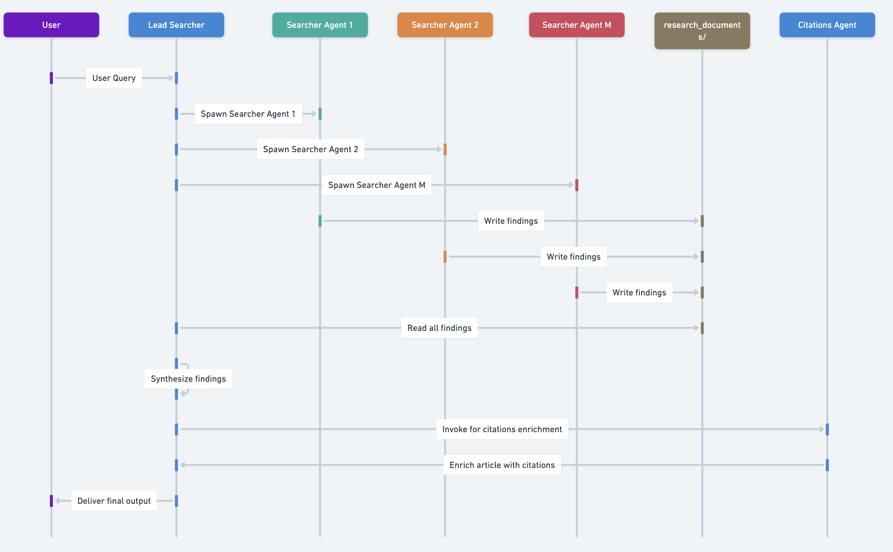

# DeepSearch Agent

A sophisticated multi-agent research system built with Strands DeepAgents that combines strategic planning, parallel research execution, and automated citation management to produce comprehensive, well-sourced research reports.

## Overview

DeepSearch demonstrates an advanced agent architecture that orchestrates multiple specialized agents to conduct thorough research on any topic. The system automatically breaks down complex queries, delegates research tasks to specialized subagents, synthesizes findings, and enriches reports with proper citations.

## Architecture



The system follows a multi-stage workflow with specialized agents:

### Agent Roles

1. **Research Lead Agent** (`research_lead`)
   - Analyzes user queries and develops comprehensive research strategies
   - Determines query type: depth-first (multiple perspectives), breadth-first (distinct subtopics), or straightforward
   - Spawns and coordinates multiple research subagents in parallel
   - Synthesizes findings from all subagents into coherent reports
   - Delegates citation enrichment to the citations agent

2. **Research Subagents** (`research_subagent`)
   - Execute focused research tasks on specific topics or perspectives
   - Perform web searches using configurable internet search tools (Linkup, Tavily)
   - Save findings to files to keep context lean
   - Store source documents in structured directories for later citation
   - Follow a research budget to avoid excessive tool usage (max 20 calls per subagent)

3. **Citations Agent** (`citations_agent`)
   - Reads synthesized reports and all source documents
   - Adds inline citations to support key claims
   - Generates a comprehensive references section
   - Uses lightweight Claude Haiku 4.5 model for efficiency

## Workflow

The research process follows this sequence:

1. **User Query** → Research Lead receives the query
2. **Planning** → Lead analyzes query and creates research plan
3. **Parallel Execution** → Lead spawns multiple research subagents simultaneously
4. **Research** → Each subagent:
   - Conducts web searches
   - Saves findings to `./research_findings_[topic].md`
   - Stores sources in `./research_documents_[topic]/source_N.md`
5. **Synthesis** → Lead reads all findings and creates comprehensive report
6. **Citation** → Citations agent enriches report with proper references
7. **Delivery** → Final cited report returned to user

## Features

### Intelligent Query Analysis
- Automatically determines query complexity and type
- Optimizes research strategy based on query characteristics
- Scales from simple fact-finding to complex multi-perspective analysis

### Parallel Research Execution
- Deploys multiple subagents simultaneously for efficiency
- Configurable subagent count (1-20) based on task complexity
- Smart task allocation to minimize overlap and maximize coverage

### Context Management
- File-based research storage prevents context window overflow
- Structured source document organization for reliable citation
- Lean context throughout the research process

### Flexible Search Integration
- Supports multiple internet search tools (Linkup, Tavily)
- Randomized tool selection for load distribution
- Easily extensible to add new search providers

### Automated Citations
- Intelligent citation placement avoiding over-citation
- Semantic unit-based citations (complete thoughts, not fragments)
- Proper reference formatting with source URLs

### Retry & Error Handling
- Automatic retry for transient network errors
- Graceful handling of streaming interruptions
- Configurable retry attempts and backoff

## Installation

1. **Install dependencies**:
```bash
# Activate virtual environment
source venv/bin/activate

# Install requirements
uv pip install -r requirements.txt
```

2. **Configure API keys**:
Create a `.env` file in the project root with:
```env
# Required for AI models
ANTHROPIC_API_KEY=your_anthropic_key

# Required for internet search (choose at least one)
LINKUP_API_KEY=your_linkup_key
TAVILY_API_KEY=your_tavily_key

# Optional: bypass tool consent for automation
BYPASS_TOOL_CONSENT=true
```

## Usage

### Basic Usage

Run a research query:

```bash
python agent.py --prompt "Current state of AI safety in 2025"
```

### Command-Line Arguments

- `-p, --prompt`: Research query (required)

Example:
```bash
python agent.py -p "Compare quantum computing approaches: superconducting qubits vs trapped ions"
```

### Customization

#### Using Different Search Tools

In `agent.py`, modify the search tool:

```python
# Use Tavily
from strands_tools import tavily
agent = create_deepsearch_agent(research_tool=tavily, tool_name="tavily")

# Use custom search tool
from tools import internet_search
agent = create_deepsearch_agent(research_tool=internet_search)
```

#### Adjusting Rate Limits

Edit `config.py` to configure rate limiting:

```python
RATE_LIMIT_CONFIG = {
    "min_time_between_calls": 0.15,  # Seconds between API calls
    "max_concurrent_subagents": 4,   # Parallel subagent limit
}
```

#### Changing Models

Modify model selection in `agent.py`:

```python
from strands_deep_agents.ai_models import get_default_model, basic_claude_haiku_4_5

# For research subagents (default: Claude Sonnet)
research_subagent = SubAgent(
    # ...
    model=get_default_model(),  # Or specify another model
)

# For citations agent (lightweight: Claude Haiku)
citations_agent = SubAgent(
    # ...
    model=basic_claude_haiku_4_5(),
)
```

## Output Files

The system creates several files during execution:

- `./research_findings_[topic].md` - Individual subagent findings
- `./research_documents_[topic]/source_N.md` - Source documents with URLs
- `./[final_report_name].md` - Synthesized report with citations
- `./.agent_sessions/` - Session state and conversation history
- `/tmp/deepsearch.log` - Detailed execution logs

## Configuration

### Rate Limiting (`config.py`)

Configures API rate limits and concurrency:

- `min_time_between_calls`: Minimum delay between API calls (default: 0.15s for 6.67 QPS)
- `max_retries`: Retry attempts for failed calls (default: 3)
- `initial_backoff_seconds`: Initial backoff time, doubles per retry (default: 1s)
- `max_concurrent_subagents`: Maximum parallel subagents (default: 4)

### Search Configuration

Search tool settings in `config.py`:

- `depth`: Search depth level (default: "standard")
- `output_type`: Response format (default: "sourcedAnswer")
- `include_images`: Include images in results (default: False)
- `include_inline_citations`: Include citations in search results (default: False)

## Logging

Logs are written to both console and `/tmp/deepsearch.log`:

- **INFO level**: Agent execution progress, task completion
- **WARNING level**: Strands framework messages (reduced noise)
- **DEBUG level**: Detailed tool usage (disabled by default)

View live logs:
```bash
tail -f /tmp/deepsearch.log
```

## Research Guidelines

### Query Types

The system automatically categorizes queries:

1. **Depth-first**: Multiple perspectives on one topic
   - Example: "What are the most effective treatments for depression?"
   - Strategy: Deploy subagents exploring different viewpoints/methodologies

2. **Breadth-first**: Multiple distinct subtopics
   - Example: "Compare economic systems of Nordic countries"
   - Strategy: Deploy subagents for each independent subtopic

3. **Straightforward**: Direct, focused questions
   - Example: "What is the current population of Tokyo?"
   - Strategy: Single focused subagent

### Subagent Count Guidelines

- Simple queries: 1 subagent
- Standard complexity: 2-3 subagents
- Medium complexity: 3-5 subagents
- High complexity: 5-10 subagents
- Maximum: 20 subagents (system limit)

### Research Budget

Each subagent has resource limits:

- Maximum 20 tool calls per subagent
- Maximum ~100 sources across all subagents
- Automatic termination when limits reached
- Diminishing returns detection to stop early

## Best Practices

### Query Formulation

- Be specific about time constraints: "as of 2025", "in the last 6 months"
- Specify desired output format: "detailed comparison", "executive summary"
- Include context: "for enterprise use", "focusing on cost implications"

### Performance Optimization

- Start with simpler queries to test setup
- Monitor log files for rate limit issues
- Adjust `max_concurrent_subagents` based on API limits
- Use Haiku model for citation agent to reduce costs

### Error Handling

- Check logs for network errors: `grep "error" /tmp/deepsearch.log`
- Verify API keys are properly set in `.env`
- Ensure sufficient API credits/quotas
- Review retry configuration if experiencing transient failures

## Troubleshooting

### Common Issues

**Issue**: "Response ended prematurely" or protocol errors
- **Solution**: System automatically retries up to 3 times. Check network connection and API status.

**Issue**: Rate limit errors
- **Solution**: Increase `min_time_between_calls` in `config.py` or reduce `max_concurrent_subagents`.

**Issue**: Context overflow
- **Solution**: System uses file-based storage to prevent this. Check that file operations are working correctly.

**Issue**: Missing citations in final report
- **Solution**: Verify that research subagents saved sources to `./research_documents_[topic]/` directories.

**Issue**: Empty or incomplete research findings
- **Solution**: Check API keys, verify internet connectivity, review logs for tool execution errors.

## Advanced Usage

### Custom Search Tools

Create your own search tool in `tools/internet_search.py`:

```python
@tool
def custom_search(query: str) -> str:
    """Your custom search implementation"""
    # Your search logic here
    return results
```

Then use it:

```python
from tools.internet_search import custom_search
agent = create_deepsearch_agent(research_tool=custom_search, tool_name="custom_search")
```

### Extending with Additional Agents

Add new specialized agents:

```python
analysis_agent = SubAgent(
    name="analysis_agent",
    description="Specialized agent for data analysis",
    prompt=ANALYSIS_AGENT_PROMPT,
    tools=[...],
    model=get_default_model(),
)

agent = create_deep_agent(
    instructions=lead_prompt,
    subagents=[research_subagent, citations_agent, analysis_agent],
    tools=[file_read, file_write],
)
```

### Session Management

The system uses persistent session storage:

```python
session_manager = FileSessionManager(
    session_id="your-session-id",
    storage_dir="./.agent_sessions",
)
```

To resume from previous session, use the same `session_id`.

## Project Structure

```
deepsearch/
├── agent.py                    # Main agent implementation
├── config.py                   # Configuration settings
├── README.md                   # This file
├── img/
│   └── sequence.png           # Architecture diagram
├── prompts/
│   ├── research_lead.py       # Lead agent prompt
│   ├── research_subagent.py   # Subagent prompt
│   ├── citations_agent.py     # Citations agent prompt
│   └── reference/             # Original prompt references
└── tools/
    ├── __init__.py
    └── internet_search.py     # Internet search tools
```

## Dependencies

Core requirements:

- `strands-agents` - Base agent framework
- `strands-deep-agents` - Multi-agent orchestration
- `strands-tools` - Tool library (file operations, Tavily)
- `linkup` - Linkup search API client
- `python-dotenv` - Environment variable management
- `anthropic` - Claude AI models

## Performance Characteristics

- **Latency**: 1-5 minutes for typical queries (3-5 subagents)
- **Cost**: ~$0.50-2.00 per research task (varies by query complexity)
- **Throughput**: Limited by API rate limits (configurable)
- **Context window**: Efficient file-based approach handles large research tasks

## License

This example is part of the Strands DeepAgents project.

## Support

For issues, questions, or contributions:
- Review logs in `/tmp/deepsearch.log`
- Check API key configuration in `.env`
- Verify dependencies are properly installed
- Consult Strands DeepAgents documentation
